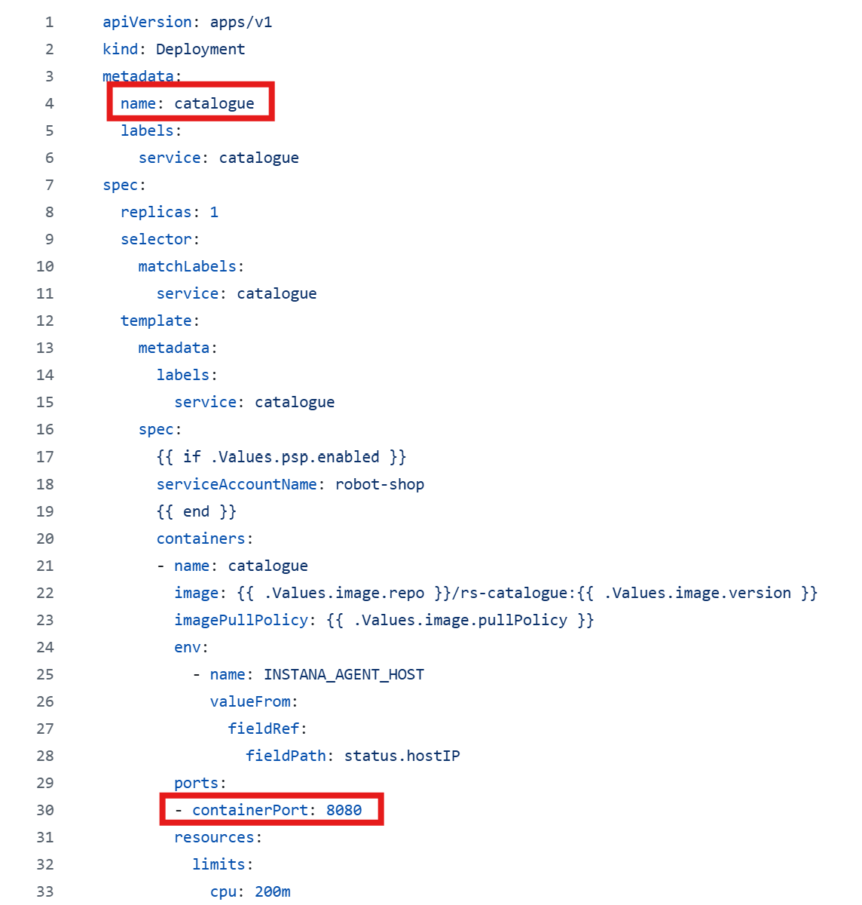
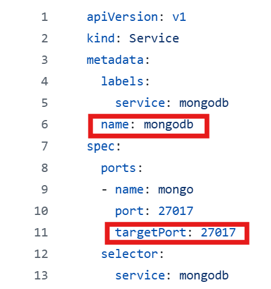

# Demo E-Commerce Project: Robot and AI Product Store

This is a demo e-commerce project that simulates an online platform for selling robots and artificial intelligence products.

The reason for choosing this project is to showcase an architecture built using multiple programming languages and microservices. Each microservice is developed using a different technology stack, representing a real-world polyglot microservices setup.

### 🛠️ Technologies Used

Our microservices are implemented using a diverse set of programming languages, frameworks, and tools:

- **Frontend (UI Layer)**:  
  - `AngularJS` – User-facing application

- **Backend Microservices**:
  - `Node.js (Express)` – User Login, Cart, Catalogue
  - `Java (Spring Boot)` – Shipping
  - `Python (Flask)` – Payments
  - `Golang` – Dispatch
  - `PHP (Apache)` – Ratings

- **Databases**:
  - `MongoDB` – Storing catalouge details
  - `Redis` – Storing cart session data
  - `MySQL` – Structured data storage (e.g., user, orders, products)

- **Messaging**:
  - `RabbitMQ` – Message brokering between microservices

- **API Gateway / Reverse Proxy**:
  - `Nginx` – Routing requests to appropriate services

### Project Origin

This project is primarily developed by **INSTANA**, an observability platform acquired by **IBM**. INSTANA provides automated application performance monitoring and root cause analysis for microservices and containerized applications.

### Project Features

This project closely mimics a real-time e-commerce application with the following functionalities:

- **Login Page**: Enables user registration and login.
- **Catalogue**: Displays various robot categories along with product details and specifications.
- **Cart**: Allows users to add and manage items in their shopping cart.
- **Shipping**: Provides options for delivery address input and calculates shipping costs.
- **Payment**: Handles payment processing for product purchases.

## 🧱 Three-Tier Architecture Overview

Our project follows a **Three-Tier Architecture**, which includes:

- **Frontend (Presentation Layer)**: UI layer where users interact with the application.
- **Backend (Logic Layer)**: Handles business logic, APIs, and service integration.
- **Database (Data Layer)**: Stores and retrieves data like user info, product details, and order history.

---

## 📐 High-Level Design & User Workflow

The application is designed as an e-commerce platform for Robots and AI products. Here's how a typical user journey looks:

1. The user visits the application.
2. The user either signs in or creates a new account.
3. Upon login, the user navigates to the **Catalogue**, which has two categories:
   - **Robots**
   - **AI Products**
4. Once a category is selected, the user sees a list of products with:
   - Product Name
   - Image
   - Description
   - Ratings
5. If interested, the user adds a product to the **Cart**.
6. The user then enters **Shipping Details**.
7. The user proceeds to enter **Payment Details**.
8. Upon successful payment, the **Order is Placed**.
9. The user receives an **Order Notification**.

---

## 🧩 Microservices in the Application

Each functional area is developed as an independent microservice:

- `user-service`
- `catalogue-service`
- `ratings-service`
- `cart-service`
- `payment-service`
- `shipping-service`
- `order-complete-service`
- `Mongo-service`
- `MySQL-service`

---

## 🗄️ Database & Messaging in the Architecture

Alongside the functional microservices, we also use dedicated services for data storage and messaging:

- **Redis**: Used for fast, in-memory data storage for the cart functionality.
- **MySQL (RDS)**: Used for storing structured, relational data such as user details, order history, and shipping info.
- **MongoDB**: Used for unstructured or flexible schema data like product catalogues and user reviews.
- **RabbitMQ**: Acts as a message broker for asynchronous communication between microservices, especially for order placement and notification events.

Each of these components plays a crucial role in supporting the scalability, responsiveness, and modularity of our application.

## 💡 Why Microservices Instead of Monolithic?

### 🔸 Monolithic Architecture

In a **monolithic application**, all functionalities (UI, logic, database) are built and deployed as a single unit.

**Used When:**
- The application is small or simple.
- The team is small and there's no need for language diversity.
- You want faster initial development and deployment.

**Example:**  
A simple blog website built using only Django or Spring Boot.

---

### 🔹 Microservices Architecture

In **microservices**, each functionality (catalogue, cart, payment, etc.) is developed, deployed, and scaled independently.

**Used When:**
- The application is complex and modular.
- You want to use different technologies/languages for different services.
- You need independent scaling and deployment.
- Teams are working in parallel on different features.

**Example:**  
E-commerce platforms like Amazon or Flipkart, where each feature is a separate service (search, cart, payment, recommendation, etc.)

---

## 🧑‍💻 Why We Chose Microservices

Although this project could be developed as a monolith using a single language, we chose microservices to:

- Showcase polyglot architecture using multiple programming languages.
- Demonstrate real-world distributed systems used in scalable cloud applications.
- Practice container orchestration and deployment using Kubernetes (EKS).

## 🌐 Language & Containerization Overview

Each microservice in this project is written using a different programming language. This demonstrates a real-world polyglot microservices architecture.

If you explore each service directory in the repository, you'll notice:

- Every service is implemented in a different language (e.g., Node.js, Java, Python, Go, PHP).
- Each service contains its own `Dockerfile`, customized for its respective language and framework.

This setup showcases how containerization helps unify deployment and scaling across services, regardless of the tech stack.

## 📸 Dockerfile References (Side by Side)

| Node.js Dockerfile | Python Dockerfile | GoLang Dockerfile |
|--------------------|-------------------|-----------------|
|  |  |  |

## 🚢 Why Use Kubernetes Over Standalone Docker?

Instead of deploying each container individually using Docker and managing networking manually (e.g., with `--link`), it's more efficient to use **Kubernetes**, which provides:

- Automatic container orchestration
- Self-healing and fault tolerance
- Horizontal scaling of services
- Better service discovery and load balancing
- Centralized configuration and secret management

---

## 📊 Kubernetes vs Docker (Standalone)

| Feature                         | Docker (Standalone)                            | Kubernetes                                     |
|---------------------------------|-------------------------------------------------|------------------------------------------------|
| **Container Orchestration**     | ❌ Manual (using scripts, `docker-compose`)     | ✅ Built-in orchestration and scheduling        |
| **Auto-scaling**                | ❌ Not available                                | ✅ HPA (Horizontal Pod Autoscaler)              |
| **Self-healing**                | ❌ Needs manual restart                         | ✅ Auto restarts failed pods                    |
| **Load Balancing**              | ❌ External setup needed                        | ✅ Built-in load balancer via Services          |
| **Rolling Updates & Rollbacks**| ❌ Manual effort                                | ✅ Native support in Deployments                |
| **Multi-node Deployment**       | ❌ Complex setup                                | ✅ Designed for multi-node, production-ready    |
| **Monitoring & Logging**        | ❌ Needs external tools                         | ✅ Easily integrates with Prometheus/Grafana    |
| **Configuration Management**    | ❌ Manual environment variables or .env files   | ✅ Secrets, ConfigMaps built-in                 |

---

## 🛠️ When to Use Docker Alone (Real-Time Use Cases)

While Kubernetes is powerful, Docker (standalone or with `docker-compose`) is still very useful in scenarios like:

- 🧪 **Local Development**: Quickly spinning up microservices on a developer’s laptop.
- 📦 **CI/CD Pipelines**: Building, testing, and packaging apps into containers before deployment.
- 🧼 **Lightweight Projects**: Simple apps or small-scale internal tools where orchestration is overkill.
- 🎓 **Learning & Training**: Teaching container fundamentals or quick prototyping.

---

In our case, we chose **Kubernetes (EKS)** because we’re simulating a real-world, production-grade, cloud-native microservices architecture.

## 📦 Helm Chart Deployment in EKS

We created custom **Helm charts** for deploying all microservices in the EKS cluster.

- For each service, we wrote separate **Kubernetes `deployment.yaml`** and **`service.yaml`** files.
- Configuration such as the container image, replicas, ports, and labels are passed through **`values.yaml`**.
- The image paths used in the charts are pulled from **Docker Hub**.

---

### 🛠️ Sample `deployment.yaml` Files

| Deployment - cart| Deployment - catalouge | Deployment - MongoDB |
|------------------------|------------------------|------------------------|
|  |  |  |

---

### 🔧 Sample `service.yaml` Files

| Service - cart | Service - catalouge | Service - MongoDB |
|-------------|-------------|-------------|
|  |  |  |

---

### ⚙️ Helm `values.yaml` (Central Config)

  

## 🚀 EKS Cluster Setup

To deploy this application on Amazon EKS, follow the instructions in the link below:

👉 [EKS Cluster Setup Guide](docs/eks-setup.md)

## 🔐 IAM OIDC + EBS Integration

To enable persistent storage for services like Redis in EKS, follow the instructions below to configure IAM OIDC and attach EBS volumes:

👉 [OIDC + EBS Setup Guide](docs/iam-oidc-ebs.md)

## 🌐 ALB Configuration

To expose the application to the external world, we need to configure an **AWS Application Load Balancer (ALB)** using the **AWS Load Balancer Controller**.

👉 [ALB Configuration Guide](docs/alb.md)

