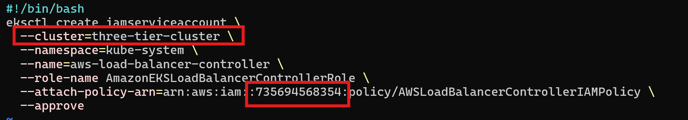
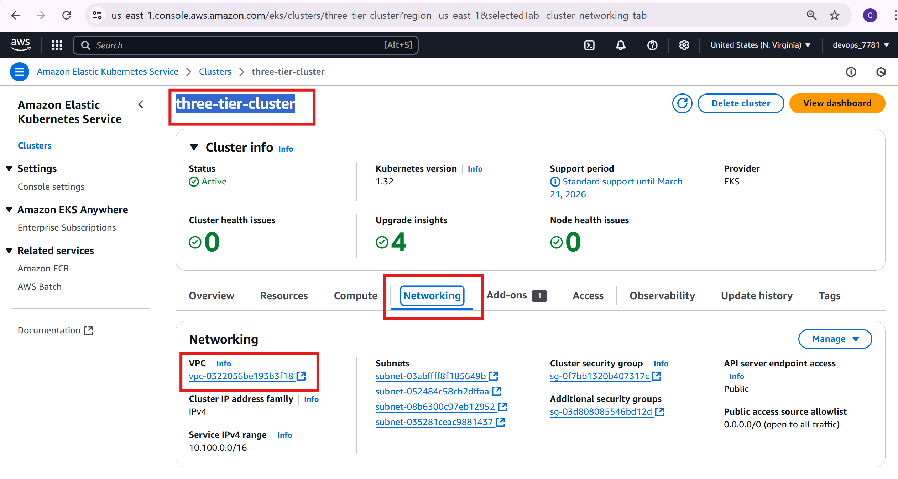

# 🌐 AWS ALB Controller Setup

To expose the application to the external world, we need to configure an **AWS Application Load Balancer (ALB)** using the **AWS Load Balancer Controller**.
---

## 🧾 Step 1: Download IAM Policy
```
curl -O https://raw.githubusercontent.com/kubernetes-sigs/aws-load-balancer-controller/v2.11.0/docs/install/iam_policy.json
```

## 🧾 Step 2: Create IAM Policy
```
aws iam create-policy \
    --policy-name AWSLoadBalancerControllerIAMPolicy \
    --policy-document file://iam_policy.json
```

## 🧾 Step 3: Create IAM Role & Service Account
```
eksctl create iamserviceaccount \
  --cluster=<your-cluster-name> \
  --namespace=kube-system \
  --name=aws-load-balancer-controller \
  --role-name AmazonEKSLoadBalancerControllerRole \
  --attach-policy-arn=arn:aws:iam::<your-aws-account-id>:policy/AWSLoadBalancerControllerIAMPolicy \
  --approve
```
**Note**: Here you should update your **cluster** and **account_id**



## 🧾 Step 4: Deploy ALB controller

Add helm repo

```
helm repo add eks https://aws.github.io/eks-charts
```

## 🧾 Step 5: Update the repo

```
helm repo update eks
```

## 🧾 Step 6: Install Helm

```
helm install aws-load-balancer-controller eks/aws-load-balancer-controller \            
  -n kube-system \
  --set clusterName=<your-cluster-name> \
  --set serviceAccount.create=false \
  --set serviceAccount.name=aws-load-balancer-controller \
  --set region=<region> \
  --set vpcId=<your-vpc-id>
```
**Note**: Here you should update your **ClusterName** and **VpcId**




Verify that the deployments are running.

```
kubectl get deployment -n kube-system aws-load-balancer-controller
```
