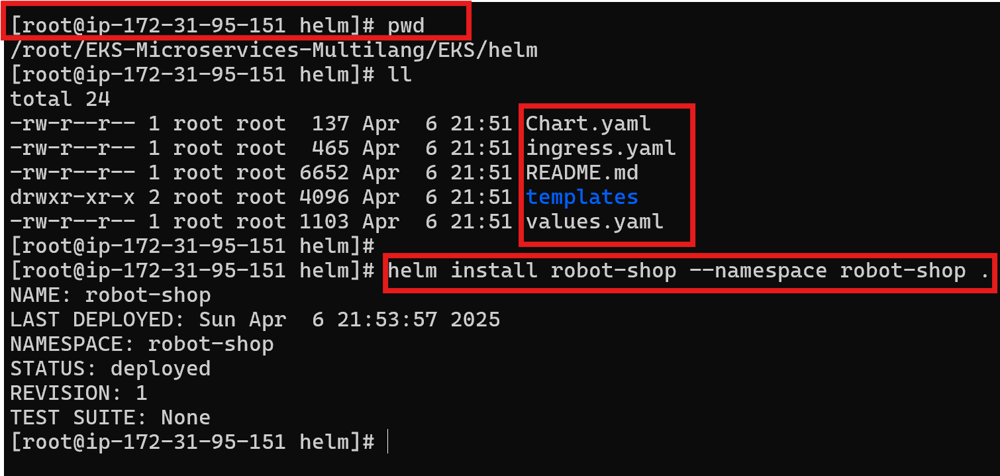

## 🧰 Helm Chart Installation – Robot Shop

Use this Helm chart to customize your install of the **Robot Shop** application.

### For Helm v2.x:
```bash
helm install --name robot-shop --namespace robot-shop .
```

### For Helm v3.x:
```bash
kubectl create ns robot-shop
helm install robot-shop --namespace robot-shop .
```

**Note**: You should clone the repo and be in the path "/root/EKS-Microservices-Multilang/EKS/helm" to install a release robot-shop. It should have charts.yaml and values.yaml in the same path to install helm.


