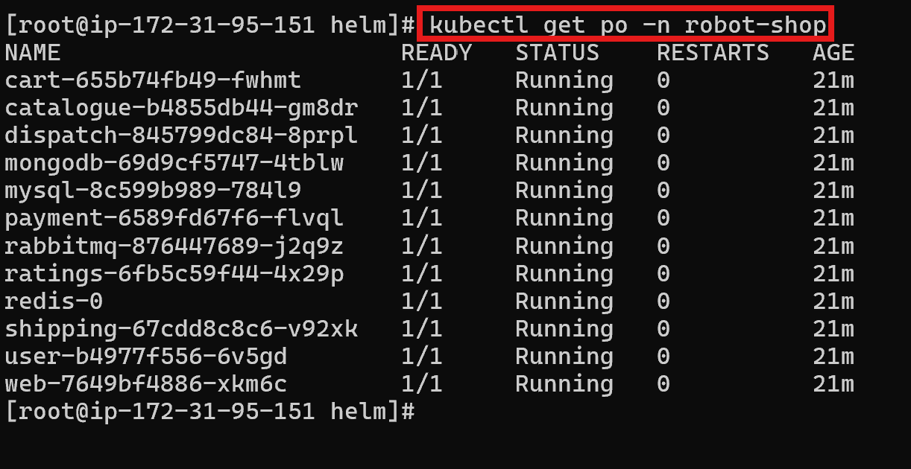
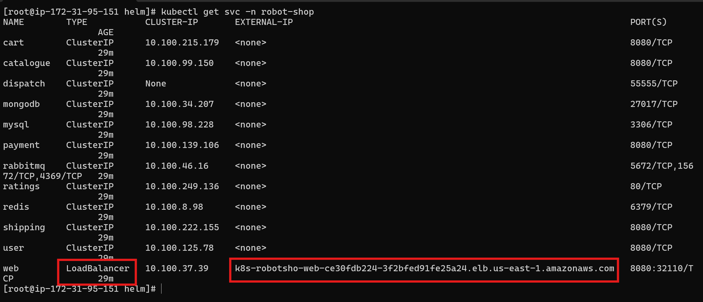

## 🧰 Helm Chart Installation – Robot Shop

Use this Helm chart to customize your install of the **Robot Shop** application.

### For Helm v2.x:
```bash
helm install --name robot-shop --namespace robot-shop .
```

### For Helm v3.x:
```bash
kubectl create ns robot-shop
helm install robot-shop --namespace robot-shop .
```
**Note:** : You should clone the repository and navigate to the path: **/root/EKS-Microservices-Multilang/EKS/helm**. This directory must contain both `Chart.yaml` and `values.yaml` in order to install the Helm release `robot-shop` successfully.


## ✅ Verify if All Pods Are Created in the `robot-shop` Namespace

Run the following command to check the status of all pods in the `robot-shop` namespace:

```bash
kubectl get pods -n robot-shop
```




## 📌 Pod and Service Verification

You can clearly see that since we specified **one replica** for each service in the `values.yaml` file, **one pod per service** (cart, catalouge, dispatch, mongodb, mysql, payment, rabbitmq, ratings, web, etc.) has been created in the `robot-shop` namespace.

You can also verify that the corresponding **services** are created in the same namespace.


