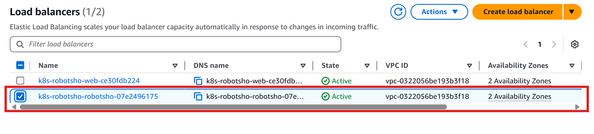

## 🧰 Helm Chart Installation – Robot Shop

Use this Helm chart to customize your install of the **Robot Shop** application.

### For Helm v2.x:
```bash
helm install --name robot-shop --namespace robot-shop .
```

### For Helm v3.x:
```bash
kubectl create ns robot-shop
helm install robot-shop --namespace robot-shop .
```
**Note:** : You should clone the repository and navigate to the path: **/root/EKS-Microservices-Multilang/EKS/helm**. This directory must contain both `Chart.yaml` and `values.yaml` in order to install the Helm release `robot-shop` successfully.


## ✅ Verify if All Pods Are Created in the `robot-shop` Namespace

Run the following command to check the status of all pods in the `robot-shop` namespace:

```bash
kubectl get pods -n robot-shop
```


## 📌 Pod and Service Verification

You can clearly see that since we specified **one replica** for each service in the `values.yaml` file, **one pod per service** (cart, catalouge, dispatch, mongodb, mysql, payment, rabbitmq, ratings, web, etc.) has been created in the `robot-shop` namespace.

You can also verify that the corresponding **services** are created in the same namespace.


## 🌐 Accessing the Application

You can access the application using the LoadBalancer URL:

👉 [https://k8s-robotsho-web-ce30fdb224-3f2bfed91fe25a24.elb.us-east-1.amazonaws.com/](https://k8s-robotsho-web-ce30fdb224-3f2bfed91fe25a24.elb.us-east-1.amazonaws.com/)

> **Note:**  
> If you're unable to access the application:
> - Check the **security group settings** for your **EKS worker nodes** and **Load Balancer**.
> - Ensure the following are allowed:
>   - **Inbound Rules**: HTTP (80), HTTPS (443), and optionally all traffic (`0.0.0.0/0`)
>   - **Outbound Rules**: All traffic

## 🌐 Ingress Controller Setup

However, it's recommended to use an **Ingress Controller** for more efficient and manageable routing of external traffic.

To create the Ingress resource, run the following command:

```bash
kubectl apply -f ingress.yaml
```

**Note:**: You should be in the path where ingress.yaml is present: **/root/EKS-Microservices-Multilang/EKS/helm**

## ✅ Verify Ingress is created or not
```bash
kubectl get ingress -n robot-shop
```
After applying the Ingress resource, go to the **AWS Console → EC2 → Load Balancers** and verify whether the **Ingress-based Application Load Balancer (ALB)** has been created successfully.

