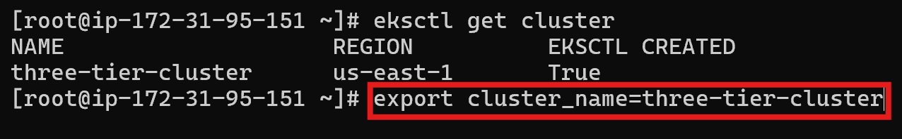
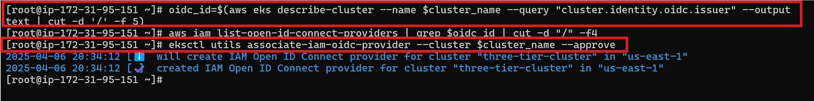

# 🔐 IAM OIDC + EBS Volume Integration for Stateful Sets

In this section, we configure the **IAM OIDC provider** and integrate **Kubernetes service accounts** with **IAM roles**. This enables pods running inside EKS to securely access AWS services like **EBS (Elastic Block Store)** — required for **stateful workloads** such as Redis.

---

## ✅ Step 1: Install IAM OIDC Provider for EKS

To allow Kubernetes service accounts to assume IAM roles, you need to enable the OIDC provider for your EKS cluster.

### 🧾 Commands

```bash
# Set your cluster name
export cluster_name=<CLUSTER-NAME>
```


# Get the OIDC ID for your cluster
```bash 
oidc_id=$(aws eks describe-cluster --name $cluster_name --query "cluster.identity.oidc.issuer" --output text | cut -d '/' -f 5) 
```

# Check if the OIDC provider is already configured
```bash
aws iam list-open-id-connect-providers | grep $oidc_id | cut -d "/" -f4
```

# If not, run the below command

```
eksctl utils associate-iam-oidc-provider --cluster $cluster_name --approve
```


